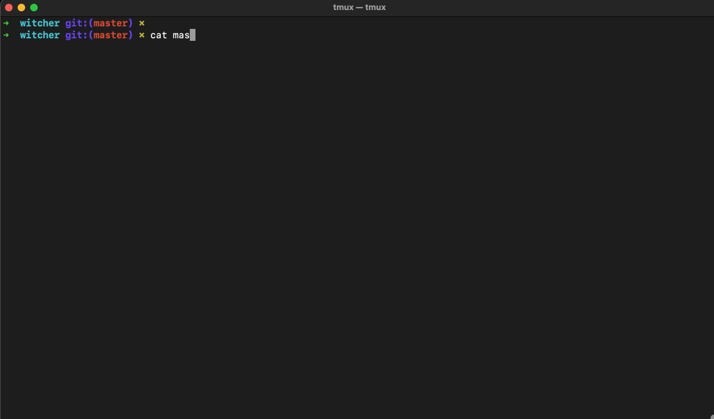

# witcher

Implement and monitor Appsec control at scale.

### Requirements
- NodeJS 20.13

### Tested on
- Mac
- Ubuntu


### How to install
```bash
$ git clone git@github.com:mf-labs/witcher.git
$ cd witcher
$ npm i
```

### Build a Docker image
```bash
$ git clone git@github.com:mf-labs/witcher.git
$ cd witcher
$ docker build -t witcher .

# Running docker image
$ docker run -e GITHUB_TOKEN=$GITHUB_TOKEN -e ORG=$ORG witcher -a status -m ghas -r offsec-sast-testing
```


### witcher's features
```bash
➜  witcher git:(master) node witcher.js -h
usage: witcher.js [-h] -m MODULE -a ACTION [--daily-summary] [--mass-action] [--slack] [--siem] [--jira]
                  [--jira-ticket JIRATICKET] [--org ORG] [-r REPO] [-b BRANCH]
                  [--workflow-file WORKFLOW] [--repo-file REPOFILE]

witcher ....... you can't escape

optional arguments:
  -h, --help            show this help message and exit
  -m MODULE, --module MODULE
                        ghas, dependabot, secret-scanning, codeql, iac, workflows, ALL
  -a ACTION, --action ACTION
                        enable, disbale, status, alert, deploy, delete
  --daily-summary       Get the Daily Summary
  --mass-action         Perform action (enable, deploy, delete) at scale
  --slack               Post new alert(s) on Slack
  --siem                Log activities on SIEM
  --jira                Post new vulnerability ticket on Jira
  --jira-ticket JIRATICKET
                        Jira ticket ID (e.g. PROJECT-123)

Input:
  --org ORG             Organization Name
  -r REPO, --repo REPO  Repository Name, ALL
  -b BRANCH, --branch BRANCH
                        Branch Name
  --workflow-file WORKFLOW
                        Workflow File Name
  --repo-file REPOFILE  Repo File Name
```



### Required Environment Variable

Set the following environment variable first

```bash
 export GITHUB_TOKEN=YOUR_GITHUB_TOKEN
 export GITHUB_USER=YOUR_GITHUB_USERNAME
 export ORG=YOUR_GITHUB_ORGANIZATION
 
 # Optional to configure slack
 export SLACK_BOT_TOKEN
 export SLACK_SIGNING_SECRET
 export SLACK_CHANNEL
 
 # Optional to send data to SIEM
 export SERVERLESS_APP_URL

 # Optional for Jira ticket creation
 export JIRA_API_TOKEN
 export JIRA_EMAIL
 export JIRA_URL
 export JIRA_PROJECT
 export JIRA_ISSUE_TYPE
```

### Exclusion

Update the `github/data/exclusion.json` file with list of repositories excluded from Core Repositories / GHAS.


### Command cheatsheet
```bash
# List repositories where GHAS is disabled
$ node witcher.js -m ghas -a status --repo All

# Enable GHAS on certain repo
$ node witcher.js -m ghas -a enable --repo <repo-name>

# Disable GHAS on certain repo
$ node witcher.js -m ghas -a disable --repo <repo-name>

# Check GHAS status on certain repo
$ node witcher.js -m ghas -a status --repo <repo-name>

# Get latest code scanning vulnerability
$ node witcher.js -m codeql -a alert --slack   // --slack to post on slack

# Mass Action
$ node witcher.js --mass-action -a enable -m ghas --repo-file mass_action.txt --jira-ticket PROJECT-123
```


#### More Commands
[More Command / Cheatsheet ](./misc/commands.sh)

### Daily Routine
```bash
# Run Daily Summary
$ node witcher.js --daily-summary -m ALL -a status --slack --jira

# Daily Summary includes the checking of
# 1. GHAS status on all repositories
# 2. Secret Scanning status on all repositories
# 3. Check for Depenabot status
# 4. Check for paused Dependabot
# 5. Code Scanning status on applicable repositories
# 6. IaC Scanning status on applicable repositories
# 7. Check alerts for any new vulnerability
# 8. Logged daily summary on SIEM and posted on Slack
```


### Disclaimer
```
- All public repositories are excluded from witcher
- All archived repositories are excluded from witcher
- All deprecated repositories are excluded from witcher
```

### Roadmap
- Custom Security Controls Monitoring: Add support for monitoring custom controls beyond CodeQL, IaC, and Dependabot.
- Customizable Daily Summary: Allow users to add additional control statuses to daily reports.
- CLI & JSON Output Support: Enable full output options via CLI arguments for both CLI and JSON formats.

### License

This project is licensed under the [Apache 2.0 License](./LICENSE)

Copyright (c) 2025 Moonfare.  

You are free to use, modify, and distribute the project, provided you include appropriate attributions to Moonfare in your use.

### Contribution

If you would like to contribute to the project, please refer to our [CONTRIBUTING.md](CONTRIBUTING.md) for guidelines.
